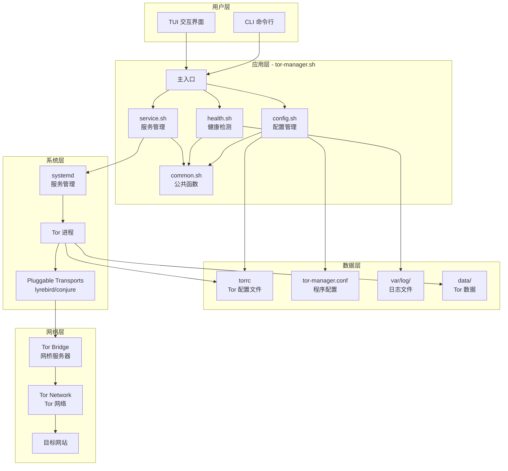
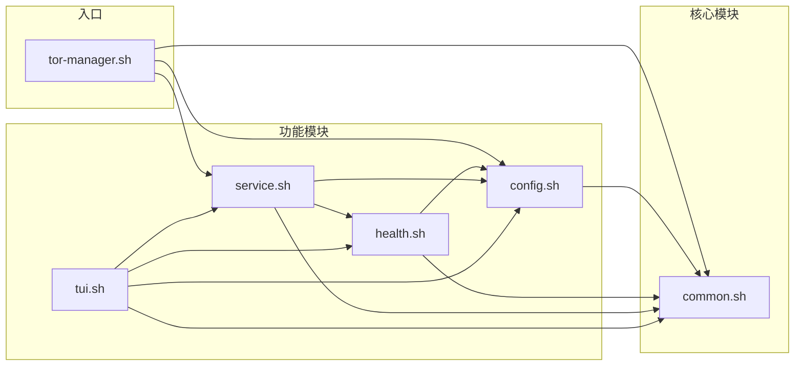
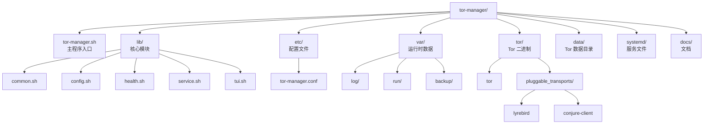
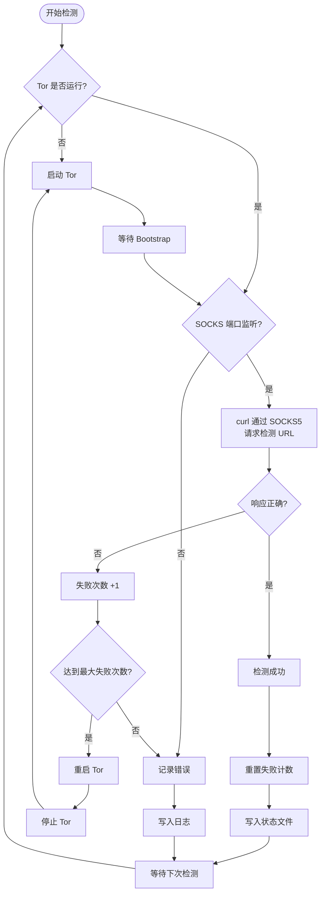
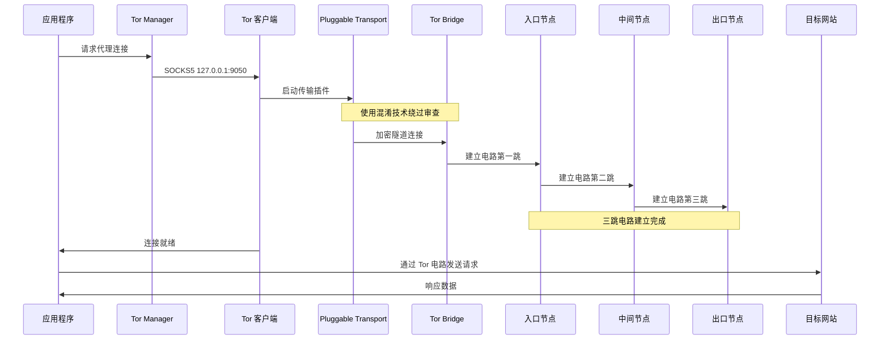
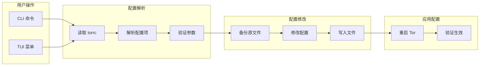
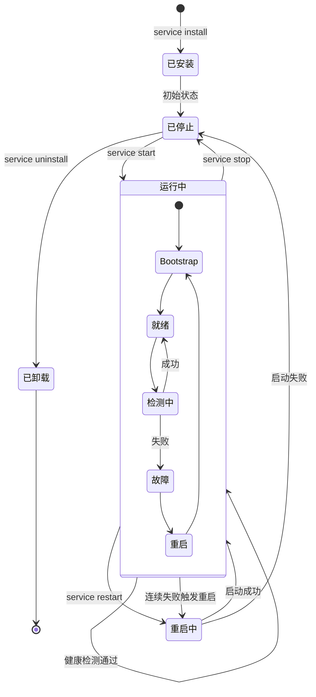
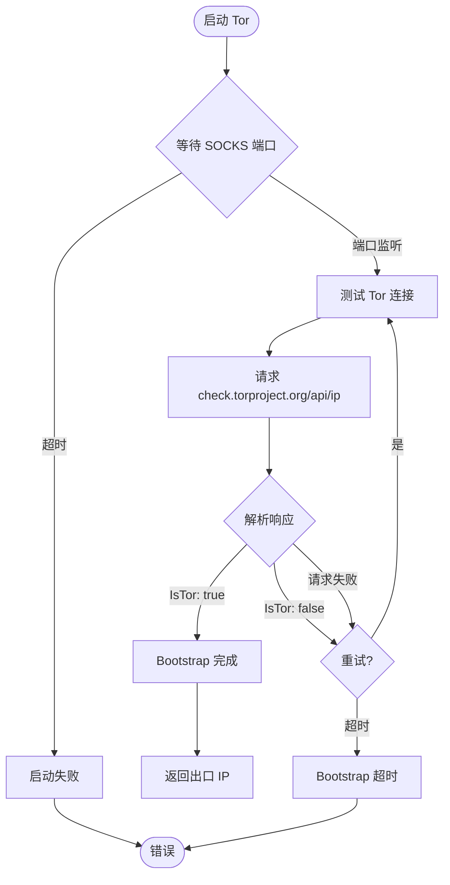
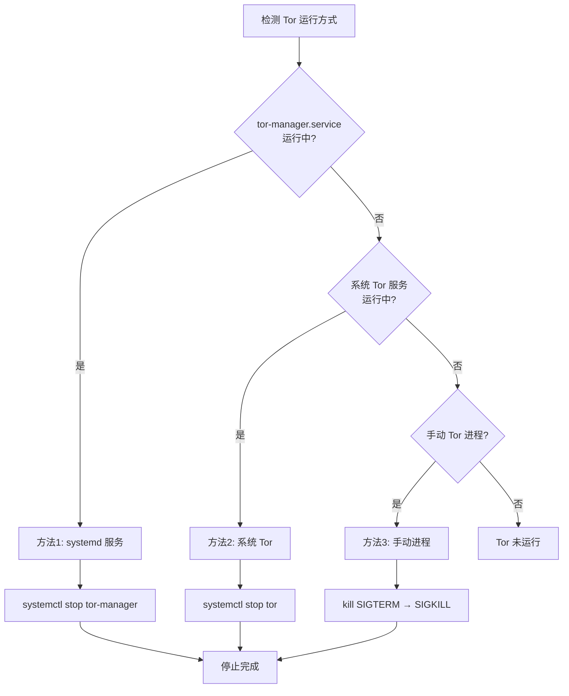
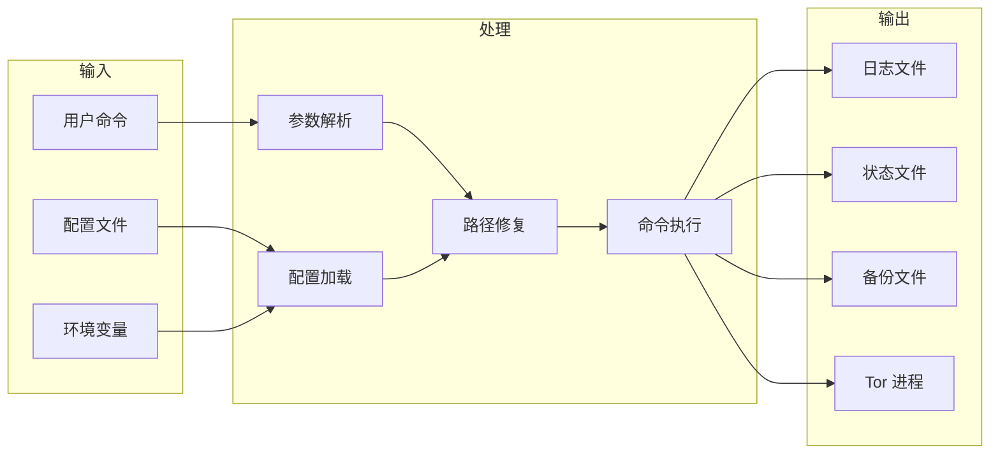

# Tor Manager 系统图表

本文档包含 Tor Manager 系统的各种专业图表，帮助理解系统架构和工作原理。

---

## 1. 系统架构图

---

## 2. 模块依赖关系图

---

## 3. 目录结构图

---

## 4. 健康检测流程图

---

## 5. Tor 连接原理图

---

## 6. 配置管理工作流程

---

## 7. 服务生命周期图

---

## 8. Bootstrap 等待流程

---

## 9. 多方法 Tor 进程管理

---

## 10. 数据流向图

---

## 图表说明

| 图表 | 说明 |
|------|------|
| 系统架构图 | 展示整体系统的分层结构和组件关系 |
| 模块依赖图 | 展示各 Shell 模块之间的依赖关系 |
| 目录结构图 | 展示项目的文件和目录组织 |
| 健康检测流程 | 展示检测、失败处理、自动重启的完整流程 |
| Tor 连接原理 | 展示 Tor 电路建立和数据传输过程 |
| 配置管理工作流 | 展示配置修改的完整流程 |
| 服务生命周期 | 展示服务状态转换关系 |
| Bootstrap 等待流程 | 展示启动后等待就绪的过程 |
| 多方法进程管理 | 展示如何检测和管理不同方式运行的 Tor |
| 数据流向图 | 展示输入、处理、输出的数据流向 |
